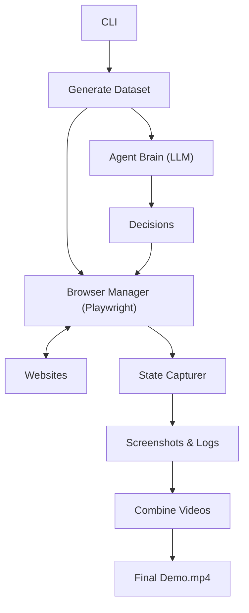

# Web Flow AI Agent 🕸️🤖


**Web Flow AI Agent** is an intelligent AI agent designed to navigate real-world websites, perform complex tasks, and capture rich datasets of UI states. It combines the power of **Playwright** for automation with **OpenAI's GPT-4o** for reasoning, enabling it to handle dynamic web environments without brittle hardcoded selectors.

## 🎯 Project Context

**The Challenge**: Traditional web automation (Selenium/Playwright) relies on hardcoded selectors (e.g., `div > .btn-primary`), which makes scripts brittle. If a website updates its UI, the bot breaks.

**The Solution**: This project demonstrates a **Generalizable AI Agent**. Instead of following a rigid script, the agent:
1.  **Observes**: Captures the accessibility tree and interactive elements of the page.
2.  **Thinks**: Uses an LLM (GPT-4o) to understand the context and decide the next best action based on a high-level goal (e.g., "Search for AutoGPT").
3.  **Acts**: Executes the action dynamically.

This approach allows the agent to adapt to different layouts and website updates automatically, mimicking human behavior.

### The Problem: Non-URL States
Not every UI state has a unique URL. For example, "creating a project" involves:
*   The project list page (has a URL)
*   The "Create Project" button state
*   The create modal (no URL)
*   The form fields (no URL)

This system navigates the live application and captures these states programmatically on the fly, ensuring a complete dataset even for complex, single-page application interactions.

## ✅ Deliverables Checklist

This project fulfills the following requirements:

- [x] **Code**: A complete UI state capture system (Python + Playwright + LLM).
- [x] **Loom/Video**: A split-screen demo showing the agent's browser view and internal thought process.
- [x] **Dataset**: Captured UI states for 4 diverse tasks across GitHub, Python.org, and Hacker News.
    -   *Task 1*: GitHub Search
    -   *Task 2*: GitHub Issues Navigation
    -   *Task 3*: Python.org Search
    -   *Task 4*: Hacker News Navigation
- [x] **Generalizability**: The system uses an LLM to decide actions at runtime, not hardcoded scripts.

## 🎥 Demo

<video src="assets/demo.mp4" controls="controls" style="max-width: 100%;">
</video>

**[Watch the full split-screen demo](assets/demo.mp4)**

## 🚀 Features

*   **🧠 AI-Powered Navigation**: Uses LLMs to understand page context and make decisions.
*   **📸 Rich Dataset Capture**: Records high-res screenshots, DOM elements, and action metadata.
*   **🎥 Split-Screen Visualization**: Generates demo videos showing the browser alongside the agent's "thought process" (logs).
*   **🛡️ Robust Heuristics**: Fallback logic for common sites (GitHub, Python.org, Hacker News).
*   **🛡️ Robust Heuristics**: Fallback logic for common sites (GitHub, Python.org, Hacker News).

## 🛠️ Installation

1.  **Clone the repository**:
    ```bash
    git clone https://github.com/Utsavd7/Web-Flow-AI-Agent.git
    cd Web-Flow-AI-Agent
    ```

2.  **Create a virtual environment**:
    ```bash
    python -m venv venv
    source venv/bin/activate
    ```

3.  **Install dependencies**:
    ```bash
    pip install -r requirements.txt
    playwright install chromium
    ```

4.  **Set up environment**:
    Create a `.env` file with your OpenAI API key:
    ```env
    OPENAI_API_KEY=sk-...
    ```

## 💻 Usage

The project includes a CLI for easy interaction.

### Generate Dataset
Run the agent on the default task suite:
```bash
python -m src.cli generate
```
*Use `--headless` to run without a visible browser window.*

### Combine Videos
Create a split-screen demo from captured data:
```bash
python -m src.cli combine
```

## 📂 Output

All data is saved to `captured_workflows/`:
*   `task_name/`: Contains screenshots (`.png`) and metadata (`.json`).
*   `combined_workflow.mp4`: The final split-screen demo video.

## 🏗️ Architecture



## 📄 License

This project is licensed under the MIT License.
